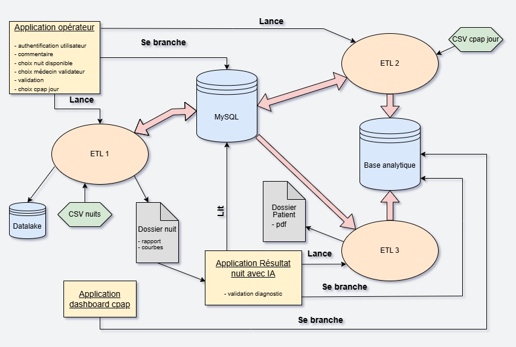
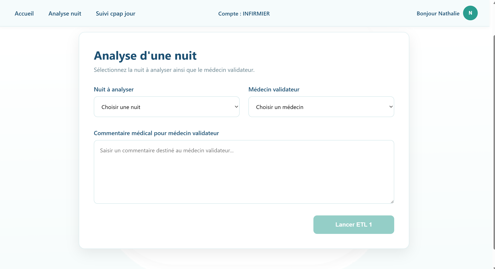
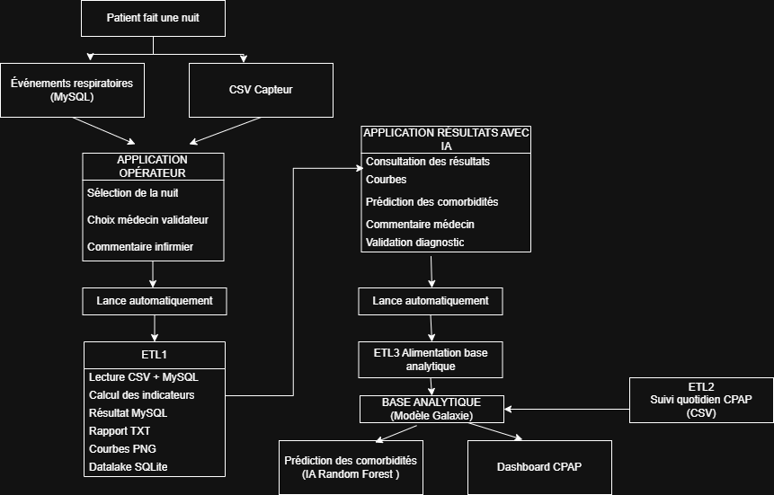
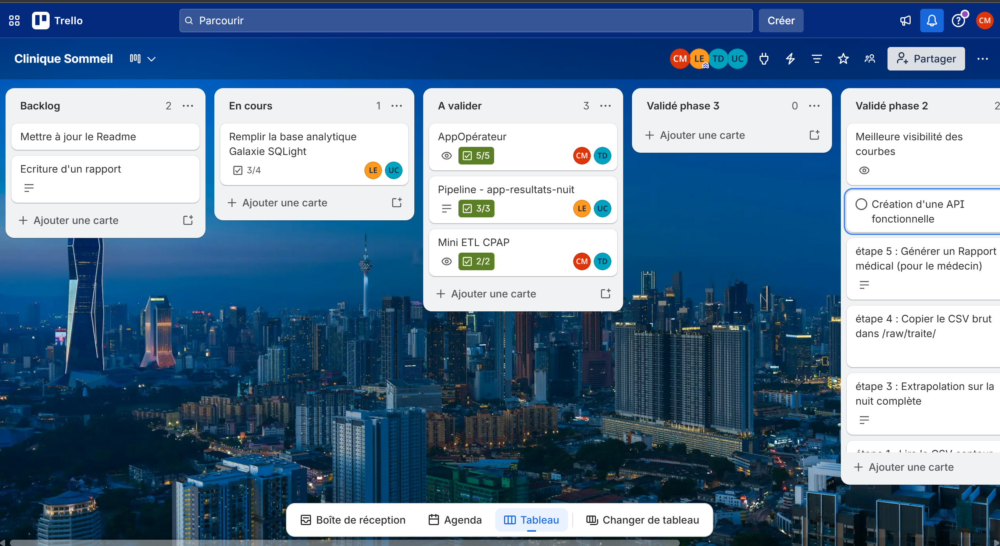
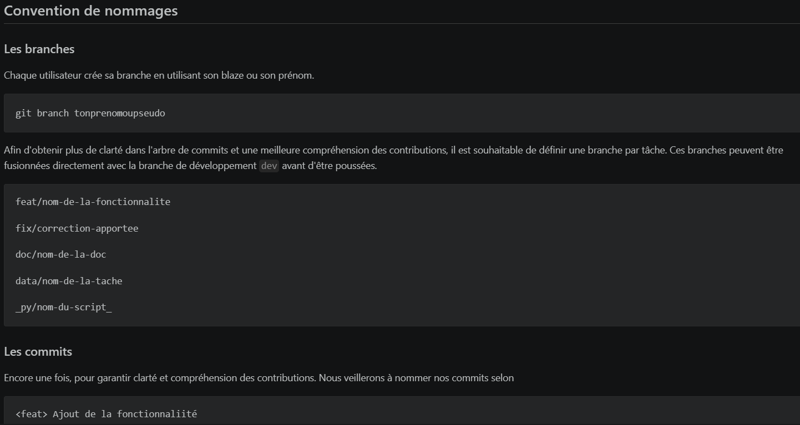
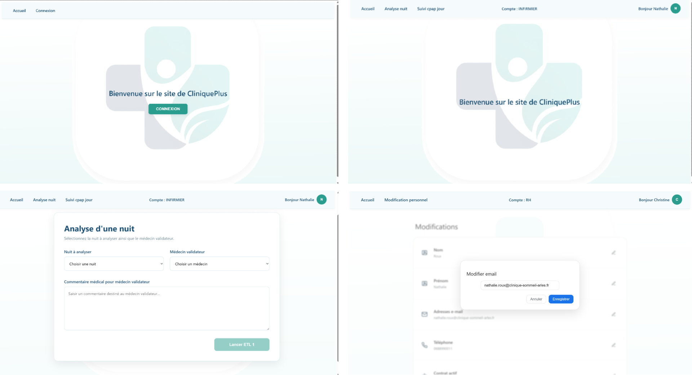

# RAPPORT DE REALISATION D'ETLs MULTIPLES SUR UN WORKFLOW D'ETUDE HOSPITALIERE

Ce projet d'ETL en 3 phases à destination des personnels de la Clinique du Sommeil d'Arles intègre plusieurs applications ainsi que plusieurs sources de données, de bonnes qualités généralement. Cette API, intégrée au système d'information permettra aux infirmiers, médecins, patients, personnels non-soignants et fournisseurs d'appareils de bénéficier d'un accès simple aux données dont chacun.e a besoin afin de pratiquer son métier efficacement. Par ailleurs, cette API intégrant un modèle d'IA permettra également d'analyser et d'émettre des prédictions quant aux alertes et schémas physiologiques décelables qui pourraient expliquer l'occurrence des alertes.

Le flux de travail que nous proposons avec cette API implique une Base de Données Relationnelle (mysql), des fichiers CSV provenant des appareils et relevés de somnographies et polygraphies, une base_analytique ainsi qu'un datalake locaux à des fins d'analyse, d'entraînement du modèle et d'anonymisation des données. Il s'articule autour de 3 processus d'ETL et se structure ainsi :



## C1, C2 : extraction et requêtes SQL (rappel ETL1, ETL3, mini ETL CPAP)

C1 . **Automatiser l'extraction de données** depuis un service web, une page web (scraping*), un fichier de données, une base de données et un système big data* en programmant le script* adapté afin de pérenniser la collecte des données nécessaires au projet.

## Présentation globale du projet

Le projet repose sur trois applications métiers, une API REST développée avec Express et trois pipelines ETL permettant d'automatiser le traitement des données des nuits d'étude et du suivi CPAP.

Il s'articule autour des trois applications suivantes :

- **Application Opérateur** : permet à l'infirmier de sélectionner une nuit d'étude à traiter, choisir le médecin validateur, saisir un commentaire médical et lancer automatiquement l'ETL1.

- **Application Résultats Nuit avec IA** : permet de consulter les résultats de la nuit, visualiser les courbes et le rapport médical, afficher une prédiction de comorbidités grâce à un modèle Random Forest, ajouter le commentaire du médecin, valider le diagnostic, déclencher l’ETL3 et générer automatiquement le PDF du patient.

- **Dashboard CPAP** : permet de suivre quotidiennement les patients traités par CPAP, consulter les alertes, les indicateurs de suivi et les statistiques d'utilisation.

Pour alimenter ces applications, trois pipelines ETL ont été développés :

- **ETL1** traite une nuit d'étude complète à partir du fichier CSV des capteurs et des événements respiratoires stockés dans MySQL. Il calcule les indicateurs médicaux, alimente la base opérationnelle MySQL, génère le rapport médical et les courbes, puis alimente le datalake SQLite avec les données brutes et les données préparées.

- **ETL2** importe les données quotidiennes de suivi CPAP depuis un fichier CSV, calcule automatiquement les alertes métier (observance < 4 h et IAH résiduel > 5) et alimente la table faits_suivi_cpap_jour de la base analytique SQLite. Ces données sont ensuite exploitées par le Dashboard CPAP.

- **ETL3** extrait les données médicales validées de la base opérationnelle MySQL et alimente la base analytique SQLite (modèle galaxie).Cette base est exploitée par le Dashboard CPAP pour les analyses et par le module IA Comorbidités, qui utilise ces données historiques pour entraîner un modèle Random Forest capable de prédire les comorbidités les plus probables d'un patient.

## Focus sur l'ETL1

### Objectif

L'ETL1 automatise le traitement complet d'une nuit d'étude polysomnographique. Il est lancé depuis l'application Opérateur après que l'infirmier sélectionne une nuit, choisisse le médecin validateur et saisisse un commentaire infirmier.

### Technologies utilisées

- Python
- Pandas
- MySQL
- SQLite (Datalake)
- Matplotlib
- Streamlit (prototype)
- Angular
- NodeJS / Express (API REST)
- Git / GitHub

---

## Fonctionnement de l'ETL

### 1. Extraction

Le pipeline recherche automatiquement le fichier CSV correspondant à l'identifiant de la nuit, puis le charge avec Pandas.

```bash
chemin_csv, id_patient = trouver_csv_depuis_id_nuit(id_nuit)

df = lire_csv_capteur(chemin_csv)
```

Le script vérifie également que le fichier existe et que toutes les colonnes obligatoires sont présentes.

---

### 2. Transformation

Les indicateurs médicaux sont calculés automatiquement à partir du signal :

- SpO₂ minimale, moyenne et médiane
- durée d'hypoxie
- position dominante
- intensité des ronflements
- nombre de ronflements forts

```bash
def calculer_indicateurs_signal(df, duree_nuit_min):
```

Cette fonction transforme les données brutes du capteur en indicateurs médicaux (SpO₂, IAH, hypoxie, ronflements, position dominante…) qui seront enregistrés dans MySQL
---

### 3. Chargement

Les indicateurs sont transmis à une procédure stockée MySQL afin de créer le résultat médical de la nuit.

```bash
curseur.callproc(
    "sp_creer_resultat_nuit",
    [...]
)
```

Le pipeline génère ensuite :

- le rapport médical (.txt),
- les courbes (PNG),
- l'alimentation du datalake SQLite (raw_capteur et curated_nuit).

```bash
generer_rapport_texte(resultat, dossier_sortie)

generer_courbes(df, id_nuit, dossier_sortie)

initialiser_datalake()

alimenter_raw_capteur(df, id_nuit)

alimenter_curated_nuit(id_nuit, resultat)

```

---

### 4. Gestion des erreurs

Le pipeline prévoit une gestion des erreurs afin d'assurer la fiabilité du traitement.

- fichier CSV introuvable ;
- erreur lors de l'exécution des opérations MySQL.

Exemples :

```bash
if not os.path.exists(chemin_fichier):
    raise FileNotFoundError(
        f"Le fichier {chemin_fichier} est introuvable."
    )


except MySQLError as erreur:
    raise RuntimeError(
        f"Erreur MySQL lors de l'appel à la procédure stockée : {erreur}"
    ) from erreur
```

---

## Résultat obtenu

À la fin de l'exécution :

- le résultat médical est enregistré dans **MySQL** ;
- le rapport et les courbes sont générés automatiquement ;
- le datalake SQLite est alimenté ;
- le fichier CSV est déplacé dans le dossier `raw/traite`.

## Conclusion

L'ETL1 répond à la compétence C1 car il automatise l'ensemble du processus d'extraction, de transformation et de chargement des données. Il centralise les données provenant des fichiers CSV et de MySQL, produit automatiquement les indicateurs médicaux, les rapports et les visualisations, puis alimente les bases de données utilisées par les applications métiers et les traitements analytiques.

### Lola

**C2.Développer les requêtes de type SQL d'extraction des données** depuis un système de gestion de base de données et un système big data en appliquant le langage de requête propre au système afin de préparer la collecte des données nécessaires au projet.

**Alimentation_base_analytique**
Ce fichier est un ETL(3) qui a pour objectif d’alimenter la base_analytique.db avec les données de la base de données relationnelle de la Clinique du Sommeil d’Arles (cliniquenuitscompletes.sql).

- Connexion du fichier à MySQL :
*Nous avons choisi de sécuriser cette connexion en plaçant les données sensibles en dur (mot de passe, port et non de la base) dans un fichier non suivi par Git.*

```bash
import mysql.connector
from mysql.connector import Error as MySQLError
from mdp import motdepasse, bdd, port

MYSQL_CONFIG = {
    "host": "localhost",
    "user": "root",
    "password": motdepasse,
    "database": bdd,
    "port": port,
    "use_pure": True
}
   - Connexion du fichier à Sqlite : 
```bash
import sqlite3

connexion = sqlite3.connect(chemin_db)
connexion.commit()
curseur.close()
```

- Afin d’alimenter la table dim_temps, nous exécutons cette requête directement depuis l’ETL, car aucune donnée ne provient ici de MySQL.

```bash
def charger_dim_temps (conn_sqlite):
    cursor_sqlite = conn_sqlite.cursor()

    # Dates de début et de fin
    date_debut = datetime(2020, 1, 1)
    date_fin = datetime(2027, 12, 31)

    # Initialisation
    date_courante = date_debut

    # Jours de la semaine
    jours = [
        "lundi",
        "mardi",
        "mercredi",
        "jeudi",
        "vendredi",
        "samedi",
        "dimanche"
    ]

    while date_courante <= date_fin:

        id_temps = int(date_courante.strftime("%Y%m%d"))
        date_complete = date_courante.strftime("%Y-%m-%d")
        annee = date_courante.year
        mois = date_courante.month
        jour = date_courante.day
        trimestre = (mois - 1) // 3 + 1
        jour_semaine = jours[date_courante.weekday()]
        est_weekend = 1 if date_courante.weekday() >= 5 else 0

        cursor_sqlite.execute(
            "SELECT 1 FROM dim_temps WHERE id_temps = ?",
            (id_temps,)
        )

        if cursor_sqlite.fetchone() is None:
            cursor_sqlite.execute("""
                INSERT INTO dim_temps (
                    id_temps,
                    date_complete,
                    annee,
                    mois,
                    jour,
                    trimestre,
                    jour_semaine,
                    est_weekend
                )
                VALUES (?, ?, ?, ?, ?, ?, ?, ?)
            """, (
                id_temps,
                date_complete,
                annee,
                mois,
                jour,
                trimestre,
                jour_semaine,
                est_weekend
            ))

        date_courante += timedelta(days=1)

        conn_sqlite.commit()

```

- Requête de récupération des données MySQL pour alimenter la table dim_patient :

```bash
def charger_dim_patient(id_patient, conn_sqlite):
    cursor_sqlite = conn_sqlite.cursor()
   
    conexion_mysql = None
    conexion_sqlite = None

# Récupération des données de la table patient dans MySQL
    try:
        conexion_mysql = get_mysql_connection()
        cursor_mysql = conexion_mysql.cursor(dictionary=True)

        conexion_sqlite = sqlite3.connect("base_analytique.db")
        cursor_sqlite = conexion_sqlite.cursor()

        query = """
            SELECT
                id_patient, nom, prenom, date_naissance, sexe,
                imc_initial, fumeur AS fumeur_initial,
                pa_tabac AS pa_tabac_initial, profession,
                niveau_activite, CURDATE() AS date_maj
            FROM patient
            WHERE id_patient = %s
        """

        cursor_mysql.execute(query, (id_patient,))
        fila = cursor_mysql.fetchone()

        if fila is None:
            print(f"Patient {id_patient} introuvable")
            return

# Intégration des données récupérées dans sqlite 
        cursor_sqlite.execute(
            """INSERT OR IGNORE INTO dim_patient
               (id_patient, nom, prenom, date_naissance, sexe, imc_initial,
                fumeur_initial, pa_tabac_initial, profession, niveau_activite, date_maj)
               VALUES (?, ?, ?, ?, ?, ?, ?, ?, ?, ?, ?)""",
            (
                int(fila["id_patient"]),
                str(fila["nom"]),
                str(fila["prenom"]),
                str(fila["date_naissance"]),
                str(fila["sexe"]),
                float(fila["imc_initial"]),
                str(fila["fumeur_initial"]),
                float(fila["pa_tabac_initial"]),
                str(fila["profession"]),
                str(fila["niveau_activite"]),
                str(fila["date_maj"]),
            )
        )

        conexion_sqlite.commit()
        print(f"Patient {id_patient} traité")

    finally:
        if conexion_mysql is not None and conexion_mysql.is_connected():
            conexion_mysql.close()

        if conexion_sqlite is not None:
            conexion_sqlite.close()

    conn_sqlite.commit()
```

- Création de la procédure dans MySQL **recuperation_donnees_pour_faits_nuits_base_**  

```bash
CREATE DEFINER=`root`@`localhost` PROCEDURE `recuperation_donnees_pour_faits_nuit_base_analytique`(
IN p_id_patient INT
)
BEGIN 
  SELECT
        r.id_nuit,
        CAST(DATE_FORMAT(n.date_nuit, '%Y%m%d') AS UNSIGNED) AS id_temps,
  n.id_patient,
        r.iah,
        r.severite_iah,
        r.spo2_min,
        r.spo2_moy,
        r.spo2_mediane,
        r.nb_apnees,
        r.nb_hypopnees,
        r.nb_rera,
        r.nb_microeveils,
        r.duree_sommeil_min,
        r.duree_hypoxie_min,
        r.position_dominante,
        r.decibels_max,
        r.decibels_moy,
        r.nb_ronflements_forts,

        (
            SELECT MAX(s.id_suivi)
            FROM suivi_patient s
            WHERE s.id_patient = n.id_patient
        ) AS id_suivi_le_plus_proche,

        CASE
            WHEN r.nb_apnees = 0 THEN 0
            ELSE (
                SELECT COUNT(*)
                FROM evenement_respiratoire e
                WHERE e.id_nuit = r.id_nuit
                  AND e.type_evenement = 'apnée centrale'
            ) * 100.0 / r.nb_apnees
        END AS pct_apnees_centrales

    FROM resultat_nuit r
    JOIN nuit_etude n ON r.id_nuit = n.id_nuit
    WHERE n.id_patient = p_id_patient;
END
```

- Appel de la procédure stockée "recuperation_donnees_pour_faits_nuit_base_analytique" dans MySQL pour alimenter la table fait_nuit :

```bash
def charger_fait_nuit(id_patient, conn_sqlite):
    cursor_sqlite = conn_sqlite.cursor()

    print([id_patient])
    conexion_mysql = get_mysql_connection()

#Récupération des données via la procédure
    df = pd.read_sql(
    "call cliniquesommeil2.recuperation_donnees_pour_faits_nuit_base_analytique(%s)",
    conexion_mysql,
    params=[id_patient]
)

    if df.empty:
        print(f"Patient {id_patient} introuvable")
    
    else:

        fila1= df.iloc[0]

#Insertion des données dans la base sqlite
        cursor_sqlite.execute (
        """INSERT OR IGNORE INTO faits_nuits
            (id_nuit,id_patient,id_temps,iah, severite_iah, spo2_min, spo2_moy, spo2_mediane, nb_apnees, nb_hypopnees, nb_rera, nb_microeveils,duree_sommeil_min,
            duree_hypoxie_min, position_dominante, decibels_max, decibels_moy, nb_ronflements_forts, id_suivi_le_plus_proche, pct_apnees_centrales)
            VALUES (?, ?, ?, ?, ?, ?, ?, ?, ?, ?, ?, ?, ?, ?, ?, ?, ?, ?, ?, ?)""",
        (
            int (fila1["id_nuit"]),
            int (fila1["id_patient"]),
            int (fila1["id_temps"]),
            float(fila1["iah"]),
            str(fila1["severite_iah"]),
            float(fila1["spo2_min"]),
            float(fila1["spo2_moy"]),
            float(fila1["spo2_mediane"]),
            int(fila1["nb_apnees"]),
            int(fila1["nb_hypopnees"]),
            int(fila1["nb_rera"]),
            int(fila1["nb_microeveils"]),
            int(fila1["duree_sommeil_min"]),
            float(fila1["duree_hypoxie_min"]),
            str(fila1["position_dominante"]),
            float(fila1["decibels_max"]),
            float(fila1["decibels_moy"]),
            int(fila1["nb_ronflements_forts"]),
            int(fila1["id_suivi_le_plus_proche"]),
            float(fila1["pct_apnees_centrales"]),
        )
        )

    conn_sqlite.commit()
    conexion_mysql.close()
```

## C4 : modélisation des données (schéma Galaxy + dimsuivipatient)

**Créer une base de données** dans le respect du RGPD en élaborant les modèles conceptuels et physiques des données à partir des données préparées et en programmant leur import afin de stocker le jeu de données du projet.
[Modèle relationnel de données](./modele_relationnel_donnees.pdf)
Nos services recommandent l'usage d'une base_analytique plus adaptée à l'entraînement d'IA. Celle-ci est composée des même données que notre base MySQL mais le modèle utilisé pour leur stockage est un modèle en étoile.

Pour ce projet, il est question de convertir notre modèle relationnel en modèle multidimensionnel. Nous avons d'abord établit les tables de faits en identifiant les données qui nous permettent de faire des liens entre les tables et qui sont communs aux tables de faits afin de dégager des dimensions pour notre modèle étoilé.

En étudiant le schéma de la base relationnelle ainsi que le fonctionnement des ETL, nous pouvons partir du principe que la notion de 'nuit' régit le premier ETL.

```
PATIENT --------------------- NUIT_ETUDE ---------------- APPAREIL_PSG
                                 |
                          id_nuit (PK)
                          date
                          type
                          ...
                                 │
                                 │
                ┌────────────────┴─────────────┐
                │                              │
                ▼                              ▼

      RESULTAT_NUIT               EVENEMENT_RESPIRATOIRE
      ----------------            ------------------------
      id_resultat (PK)            id_evenement (PK)
      IAH                         type
      saturation                  durée
      sommeil                     heure
```

Toutefois, c'est bien la notion de 'patient' qui régit les 2 ETL suivants.

```
PATIENT -------------------- APPAREIL_CPAP ------------- APPAREIL
                                  |
                          id_appareil (PK/FK)
                          pression
                          masque
                          ...
                                  │
                                  │
                 ┌────────────────┴────────────────┐
                 │                                 │
                 ▼                                 ▼

      SUIVI_CPAP_JOUR                BILAN_MENSUEL_CPAP
      -----------------              --------------------
      id_suivi (PK)                  id_bilan (PK)
      date                           année
      durée                          mois
      IAH                            observance
      fuite                          ...
```

Il est ensuite important de procéder à la modélisation des données en étoile pour concevvoir la base de données analytique.

Autour des tables de faits, nous identifions les dimensions 'nuit', 'temps', 'patient' et 'suivi' qui permet d'aggréger les données de suivi pour analyse.

[Modèle-Etoile](./Modèle étoile faits nuits.pdf)

## C5 : API/accès aux données (procédures stockées utilisées)

**Développer une API mettant à disposition le jeu de données** en utilisant l'architecture REST afin de permettre l'exploitation du jeu de données par les autres composants du projet.

Nous avons fait le choix de Node.js afin de déployer rapidement une API qui puisse établir un lien durable entre nos applications *backend* (API Node.js) et *frontend* (Angular/Streamlit) ainsi qu'avec nos stockages de données (SQL, SQLite).

Le parcours de l'utilisateur peut être schématisé ainsi :

```
                                PERSONNEL
                           -------------------
                           id_personnel (PK)
                           nom
                           prénom
                           ...
                              ▲
                 ┌────────────┴─────────────┐
                 │                          │
             MEDECIN                  INFIRMIER
          id_personnel (PK)        id_personnel (PK)


                                  │
                                  │ réalise
                                  │
                                  ▼

PATIENT --------------------- CONSULTATION -------------------- MEDECIN
---------                     ----------------                 ---------
id_patient (PK)           id_consultation (PK)          id_personnel (FK)
nom                        date_consultation
prénom                     motif
date_naissance             compte_rendu
...
   │
   │ possède
   ▼

COMORBIDITE
-----------------------
id_comorbidite (PK)
libellé

       ▲
       │
       │ N:N
       │
PATIENT_COMORBIDITE
-----------------------
id_patient (FK)
id_comorbidite (FK)
```

Notre configuration de l'API Node.js permet de proposer un point d'entréee principal qui invite à s'authentifier afin d'accéder aux fonctionnalités des ETL et de visualisation des données.

```ts
router.post('/login', loginController.connexionUtilisateur);
```

La route ```/login``` permet donc à Angular d'interroger la base de données afin d'authentifier l'utilisateur en foncction de son adresse électronique et son mot de passe. Si l'utilisateur existe et qu'il renseigne le bon mot de passe, il accède aux interfaces utilisateurs suivantes.

```ts
router.get('/job', loginController.findJob);
```

La route ```/job``` est configurée afin d'être sollicitée par Angular qui utilise ce canal pour récupérer le rôle de l'utilisateur et appliquer les permissions d'accès aux données.

```ts
router.get('/getPersonnel', loginController.getPersonnel);
router.get('/getInfoPersonnel', loginController.getInfoPersonnel);
router.post('/changeNamePersonnel', loginController.changeNamePersonnel);
router.post('/changePrenomPersonnel', loginController.changePrenomPersonnel);
router.post('/changeEmailPersonnel', loginController.changeEmailPersonnel);
router.post('/changePhonePersonnel', loginController.changePhonePersonnel);
router.post('/changeActifPersonnel', loginController.changeActifPersonnel);
```

Ces routes supplémentaires permettent de récupérer rapidement des données, notamment, pour les services administratifs de la Clinique.

2 routes supplémentaires ont été ajoutées à l'A.P.I. afin d'offrir la possibilité à l'infirmier et au médecin de pouvoir lancer les différents phases d'ETL depuis l'interface utilisateur Angular.

L'utilisateur appuie sur "Lancer l'ETL1"


L'appli *frontend* envoie une requête HTTP contenant les 3 paramètres à transmettre au script d'ETL vers l'API Node.js.

```js
router.get('/lancerETL1', lancerScript);

function lancerScript(req, res) {

    const pythonProcess = spawn('python', [
        "./pipeline_etl_pandas.py",
        req.query.id_nuit,
        req.query.id_medecin_validateur,
        req.query.commentaire_medical
       
    ]);
```

L'API *backend* valide l'exécution de l'ETL et notifie du bon déroulement de son lancement à l'appli *frontend*.

```ts
this.routes.lancerETL1(
      selectedNuit.id_nuit,
      selectedMedecin.id_personnel,
      comment
    ).subscribe({
      next: (res) => {
        console.log("ETL lancé :", res);

        // reset après succès
        this.commentForm.reset();
      },
      error: (err) => {
        console.error("Erreur ETL :", err);
        console.log(err.error);}
    });
```

## C14,C15 : analyse du besoin et conception technique (vos choix d'architexture pour les 2 applications)

# C14 – Analyser le besoin et modéliser l'application

## Contexte

Avant de développer les applications, nous avons réalisé une analyse fonctionnelle afin d'identifier les besoins des utilisateurs, les différentes étapes du traitement et les interactions entre les applications, les pipelines ETL et les bases de données.

L'objectif est de garantir un parcours utilisateur cohérent avant le développement technique.

---

## Architecture fonctionnelle

La figure suivante présente l'architecture fonctionnelle du projet ainsi que le parcours utilisateur, les applications développées, les pipelines ETL et les interactions entre les différentes bases de données.



*Figure 1 – Architecture fonctionnelle du projet Clinique du Sommeil d'Arles.*

Cette modélisation permet de comprendre le fonctionnement global du système :

1. Le patient réalise une nuit d'étude.
2. Les événements respiratoires sont enregistrés dans MySQL et les données des capteurs sont récupérées depuis un fichier CSV.
3. L'opérateur sélectionne la nuit, choisit le médecin validateur et ajoute un commentaire infirmier.
4. L'application Opérateur déclenche automatiquement l'ETL1.
5. L'ETL1 traite les données, calcule les indicateurs médicaux, met à jour MySQL, génère le rapport médical, les courbes et alimente le datalake SQLite.
6. Le médecin consulte ensuite les résultats dans l'application Résultats avec IA, ajoute son commentaire et valide le diagnostic.
7. Cette validation déclenche automatiquement l'ETL3, qui alimente la base analytique (modèle galaxie).
8. La base analytique est ensuite utilisée par le Dashboard CPAP pour les analyses et par le module IA Comorbidités, qui entraîne un modèle Random Forest afin de prédire les comorbidités les plus probables.

---

## User Stories

### User Story 1

**En tant qu'opérateur**, je souhaite sélectionner une nuit d'étude, choisir un médecin validateur et lancer automatiquement le traitement afin de générer le rapport médical.

### User Story 2

**En tant que médecin**, je souhaite consulter les résultats de la nuit, confirmer le diagnostic et générer le PDF du patient afin d'alimenter automatiquement la base analytique utilisée par le module IA Comorbidités.

---

## Critères d'acceptation

Le scénario est considéré comme valide lorsque :

- le diagnostic est confirmé ;
- le PDF du patient est généré ;
- l'ETL3 est exécuté automatiquement ;
- la base analytique est correctement alimentée.

---

## Accessibilité

Les applications ont été conçues en respectant des principes simples d'utilisabilité :

- navigation intuitive ;
- boutons clairement identifiés ;
- vocabulaire compréhensible ;
- limitation du nombre d'étapes pour chaque utilisateur.

---

## Conclusion

Cette analyse fonctionnelle nous a permis de définir les besoins métier, de modéliser le parcours utilisateur et d'identifier précisément le rôle des applications, des pipelines ETL et des bases de données avant le développement du projet.

### Lola

C15. **Concevoir le cadre technique d'une application integrant un service d'intelligence artificielle**, à partir de l'analyse du besoin, en spécifiant l'architecture technique et applicative et en préconisant les outils et méthodes de développement, pour permettre le développement du projet.

1. Identifier les besoins :
Cette interface s’adresse au médecin validateur désigné par l’opérateur. Elle lui permet de visualiser toutes les informations relatives à la nuit d’étude : le rapport de résultats, la courbe SpO₂, la courbe du débit nasal et la courbe des ronflements.

Elle offre également une aide au diagnostic grâce à l’interprétation de l’IA, basée sur les comorbidités du patient.

Enfin, depuis cette interface, le médecin validateur peut poser un diagnostic, via un commentaire médical de validation, puis valider le rapport final. Ce rapport sera ensuite enregistré dans le dossier du patient et téléchargé par le médecin.

1. Choisir la technologie
   - Pour l’application du médecin validateur, nous avons choisi d’utiliser Streamlit, qui permet de créer rapidement une interface.
   - Il faut également choisir l’IA la plus adaptée aux besoins identifiés précédemment. Ici, nous utilisons l’algorithme Random Forest pour une application médicale. Random Forest (RF) est l’un des algorithmes les plus utilisés en IA médicale grâce à sa robustesse et à son interprétabilité. Nous l’avons également choisi car il présente un taux de réussite de 85 % à 93 % pour la prédiction des apnées du sommeil.

2. Architecture technique
   - Création d’une application permettant de consulter les résultats des nuits d’étude.
   - Création d’un ETL (alimentation_base_analytique) afin de continuer à alimenter le modèle et d’augmenter sa fiabilité.

3. Préconnisation :
   - Concernant l’interface, elle est actuellement lente. Si l’on souhaite partir sur une interface plus performante, il faudra suivre le même modèle que l’application Opérateur et utiliser Angular.
   - Dans le cadre de l’utilisation de l’IA pour prédire les comorbidités dans une clinique du sommeil, plusieurs préconisations peuvent être formulées:
     - Tout d’abord, les variables actuellement utilisées pour alimenter le modèle Random Forest semblent insuffisamment larges. Les features utilisées sont principalement liées aux données respiratoires et physiologiques de la nuit d’étude : IAH, SpO₂ minimale, SpO₂ moyenne, nombre d’apnées, nombre d’hypopnées, durée du sommeil, IMC, tabagisme et consommation de tabac.
     Or, pour améliorer la fiabilité du modèle, il serait pertinent d’intégrer d’autres variables importantes, comme l’âge, le genre, les antécédents médicaux, les traitements en cours, les pathologies déjà connues, les habitudes de vie, les symptômes déclarés par le patient ou encore certains facteurs cardiovasculaires et métaboliques.
     - Cette limite pose également une question éthique : un modèle entraîné avec un nombre restreint de variables risque de produire des prédictions incomplètes, voire biaisées. Par exemple, si certaines catégories de patients sont sous-représentées dans les données d’entraînement, le modèle peut être moins performant pour ces profils. Cela peut entraîner une inégalité dans l’aide au diagnostic proposée aux médecins.
     Il est donc nécessaire de vérifier la représentativité des données utilisées pour entraîner l’IA. Les données doivent couvrir des profils variés de patients, notamment en termes d’âge, de sexe, d’IMC, d’antécédents médicaux et de sévérité des troubles du sommeil.
     - La fiabilité du modèle doit également être contrôlée régulièrement. Même si Random Forest est un algorithme robuste et interprétable, ses prédictions ne doivent pas être considérées comme un diagnostic automatique. L’IA doit rester un outil d’aide à la décision, et non un substitut au jugement médical. La décision finale doit toujours appartenir au médecin validateur.
     - Il est également important de mettre en place une évaluation continue du modèle. Le taux de réussite global ne suffit pas : il faut aussi analyser les faux positifs, les faux négatifs, la sensibilité, la spécificité et les performances selon différents groupes de patients. Dans un contexte médical, une erreur de prédiction peut avoir des conséquences importantes sur la prise en charge du patient.
     - Un autre enjeu éthique concerne la transparence. Le médecin doit pouvoir comprendre les grandes raisons qui ont conduit l’IA à proposer une prédiction. Il est donc recommandé d’accompagner les résultats de l’IA avec des indicateurs explicatifs, comme l’importance des variables utilisées par le modèle.
     - Enfin, l’utilisation de données médicales impose une vigilance particulière concernant la protection des données personnelles. Les données doivent être sécurisées, limitées aux informations strictement nécessaires, et utilisées dans le respect du RGPD. Il est aussi important d’informer les patients de l’utilisation possible de leurs données dans le cadre de l’amélioration du modèle.

## C16,C17 : réalisation technique (composants développés)

C16. **Coordonner la réalisation technique d'une application d'intelligence artificielle** en s'intégrant dans une conduite agile du projet et en contexte MLOps et en facilitant les temps de collaboration dans le but d'atteindre les objectifs de production et de qualité.

```

Afin de mener à bien les objectifs fixés, nous avons, suite à une lecture attentive du brief et à la suite d'une séance de brainstorming, identifié les différentes taches, sous-taches et compétences requises et avons mis en place un tableau Trello en fonction des souhaits, des compétences et des aspirations de chacun. (https://trello.com/b/Vuckm2dk).

```



```

Nous avons également utilisé Git et Github afin de sauvegarder nos codes, de conserver un historique des modifications, en respectant les règles de contributions mises en place :

```



C17. **Développer les composants techniques et les interfaces d'une application** en utilisant les outils et langages de programmation adaptés et en respectant les spécifications fonctionnelles et techniques, les standards et normes d'accessibilité, de sécurité et de gestion des données en vigeur dans le but de répondre aux besoins fonctionnels identifiés.

```

Pour mener à bien ces taches, nous avons utilisé :

 - Des dépots Github permettant un versionnement des sources (Pour le frontEnd : https://github.com/arcar/CliniquePlus---Prototype-d-interface-utilisateur.git, pour le Back-End : https://github.com/tomtoomuch/Clinique-du-Sommeil-d-Arles.git)

 - Pour la partie Front-End : 
    ANGULAR composée d'une page d'accueil, d'une page de connexion qui permet l'authentification des utilisateurs et de les répartir en 3 catégories ( Infirmiers, Médecins, RH). 
    En fonction de la catégorie authentifiée, le composant header affiche des éléments différents qui sont:

    - pour les médecins : un lien "dashboard" qui permet d'ouvrir un onglet affichant les rendus générés  via streamlit par le fichier dashboard_cpap.py, un lien "rapport nuit" qui permet d'ouvrir un onglet affichant les rendus générés via streamlit par le fichier app_resultats_nuit_avec_ia.py

    - pour les rh : un lien qui permet d'ouvrir un nouveau composant rendant possible la sélection d'un employé afin d'en afficher le profil et d'en modifier les éléments (nom, prenom, email, telephone, actif)

    - pour les infirmiers : un lien "analyse nuit" qui ouvre un composant permettant de choisir la nuit à analyser, de choisir le médecin validateur, de rentrer un commentaire médical et de valider, lançant ainsi l'ETL1 avec ces 3 composants obligatoires; un lien "suivi cpap jour" qui ouvre un composant permettant de choisir le patient qui aura ses relevés cpap jour analysés et de valider en lançant l'ETL2.
```



```

Pour le composant permettant la selection d'une nuit, d'un médecin validateur et l'ajout d'un commentaire médical et le lancement de l'ETL, voici la méthode :

```

```ts

// Déclarations des interfaces qui servent à décrire la forme que doivent avoir les différents objets

interface Nuit {
  id_nuit: number;
}

interface ApiResponse {
  success: boolean;
  message: string;
  nuitsTrouvees: Nuit[];
}

interface Medecin {
  id_personnel: number;
  nom: string;
  prenom: string;
  specialite: string;
  numero_rpps: string;
  date_embauche: string;
  telephone: string;
  email: string;
  actif: number;
  password: string;
}


```

```ts
export class AnalyseNuit implements OnInit {

  commentForm: FormGroup;  // Déclaration du formulaire

  nuits: Nuit[] = [];       //déclaration d'une variable nuits qui est un tableau nommé Nuit vide au démarrage du composant
  docs: Medecin[] = [];

  loadingNuits = false;
  loadingMedecins = false;
```

```ts
  this.commentForm = this.fb.group({        //Création de la structure du formulaire
      selectedNuit: [null, Validators.required],          //Attend qu'une nuit soit selectionnée pour que le champ du formulaire soit validé
      selectedMedecin: [null, Validators.required],     //Attend qu'un médecin soit selectionné pour que le champ du formulaire soit validé
      comment: ['', [Validators.required, Validators.minLength(3)]]     //Attend qu'un commentaire de plus de 3 lettres soit rentré pour que le champ soit validé
    });

```

```ts
ngOnInit(): void {          //Fonctions qui seront exécutées dès le chargement du composant pour récupérer la liste des nuits et des medecins disponibles
    console.log('INIT AnalyseNuit');
    this.loadNuits();
    this.loadMedecins();
  }
```

```ts
 loadMedecins() {       //Fonction qui charge la liste des médecins depuis l'API
    this.loadingMedecins = true;    // Pour affichage HTML de l'état du chargement

    this.routes.listeMedecins().subscribe({    // Appel de l'API via le service "routes" et subscribe permet de récuperer la réponse quand elle arrive
      next: (response: any) => {  // réponse quand l'API répond correctement

        this.docs = response.medecin ?? []; // stockage de la réponse dans le tableau "docs" et si pas de valeur, tableau vide (??[])

        this.loadingMedecins = false;

        this.cdr.detectChanges(); //detecte les changements pour mettre a jour le HTML

        console.log('loaded medecins:', this.docs);
      },
      error: (err) => {     //En cas d'erreur
        console.error(err);
        this.loadingMedecins = false;
      }
    });
  }
```

```ts
 submit() {

    if (this.commentForm.invalid) return;  //ici on verifie si le formulaire est valide et si non, on arrête

    const { selectedNuit, selectedMedecin, comment } = this.commentForm.value;  //On récupère les valeurs du formulaire

    if (!selectedNuit || !selectedMedecin) { //On verifie à nouveau que les champs ne sont pas vides sinon on arrête
      alert("Sélection manquante.");
      return;
    }

    this.routes.lancerETL1(     // Appel de l'API via le service "routes" avec les 3 parametres et subscribe permet de récuperer la réponse quand elle arrive
      selectedNuit.id_nuit,
      selectedMedecin.id_personnel,
      comment
    ).subscribe({
      next: (res) => {  // si API répond correctement
        console.log("ETL lancé :", res);
          
        // reset après réussite
        this.commentForm.reset();
      },
      error: (err) => {     // si erreur
        console.error("Erreur ETL :", err);
        console.log(err.error);
      }
    });
  }
```

```
- Pour la partie Back-End : 

    - Python pour le nettoyage des données, le calcul des indicateurs, la création du rapport médical, la génération des courbes, l'enregistrement des données dans un datalake, l'alimentation d'une base sqlite analytique
```

```
    Exemple d'une fonction python permettant l'alimentation d'une table de la base analytique en calculant des alertes :
```

```py
# definition de la fonction avec en paramètre les informations que l'on souhaite enregistrer
def alimenter_faits_suivi_cpap_jour(id_suivi_source, id_patient, date_jour, duree_utilisation_h, iah_residuel, 
                                    fuites_l_min, nb_evenements, qualite_donnee, id_suivi_le_plus_proche, chemin_db=DB_PATH):
    connexion = sqlite3.connect(chemin_db) #ouverture de la connexion vers sqlite

    try:    #ici on determine les alertes
        alerte_observance_insuffisante = 1 if duree_utilisation_h < 4 else 0
        alerte_iah_eleve = 1 if iah_residuel > 5 else 0

        df_cpap = pd.DataFrame([{       # ici on crée le dataFrame pandas contenant un dictionnaire
            "id_suivi_source": id_suivi_source,
            "id_patient": id_patient,
            "id_temps": int(date_jour),
            "duree_utilisation_h": duree_utilisation_h,
            "iah_residuel": iah_residuel,
            "fuites_l_min": fuites_l_min,
            "nb_evenements": nb_evenements,
            "qualite_donnee": qualite_donnee,
            "id_suivi_le_plus_proche": id_suivi_le_plus_proche,
            "alerte_observance_insuffisante": alerte_observance_insuffisante,
            "alerte_iah_eleve": alerte_iah_eleve
        }])

        import traceback    # ici on import un module permettant  d'afficher plus en détail le contenu d'eventuelles erreurs

        try:
            df_cpap.to_sql(   # insertion du dataFrame dans la base sqlite
                "faits_suivi_cpap_jour",
                connexion,
                if_exists="append",
                index=False
            )
        except Exception:   # si ca echoue, affichage de l'erreur complète
            traceback.print_exc()
            raise  # ici on relance l'insertion si il y a eu erreur

    except Exception as e:
        print(type(e))
        print(e)
        raise

    finally:
        connexion.close()  #fermeture de la connexion
```

```bash
    - JavaScript avec Express et NodeJs pour la création de l'API permettant l'utilisation de routes et requètes nécessaires à la communication entre le front et le back

    - Streamlit pour les résultats des nuits avec prédiction de comorbidités

```

## Ainsi que C8, C9 et C10 **si traité**

C8. **Paramètre un service d'intelligence articielle** en suivant sa documentation technique et en respectant les spécifications du projet, afin de permettre l'intégration des connecteurs du service das le système d'information.

C9. **Développer une API exposant un modèle d'intelligence artificielle** en utilisant l'architecture REST pour mettre l'interaction entre le modèle et les autres composants.

C10. **Intégrer l'API d'un modèle ou d'un service d'intelligence artificielle** dans une application, en respectant les spécifications du projet et les normes d'accessibilité en vigeur, à l'aide de la documentation technique de l'API, afin de créer les fonctionnalités d'intelligence artificielle de l'application.

### Lola

C21. **Résoudre les incidents techniques** en apportant les modifications nécessaires au code de l’application et en documentant les solutions pour en garantir le fonctionnement opérationnel.

Problème rencontré dans l'exécussion de l'ETL (alimentation_base_analytique) lors de son déclenchement par app_resultat_avec_ia.

```bash
sqlite3.ProgrammingError: SQLite objects created in a thread can only be used in that same thread. The object was created in thread id 21152 and this is thread id 17492.
```

Le problème rencontré ici est un conflit entre notre application Streamlit et SQLite. SQLite bloque l’exécution, car Streamlit utilise un autre thread que celui de la connexion SQLite.

Pour remédier à ce problème, nous avons consulté ChatGPT, qui nous a conseillé de modifier la gestion de la connexion SQLite dans notre ETL, en la passant d’un niveau global au niveau des fonctions.

Nous avons donc supprimé la connexion globale et nous l’avons intégrée dans chaque fonction lancée par l’ETL :

```bash
def charger_fait_nuit(id_patient, conn_sqlite):
    cursor_sqlite = conn_sqlite.cursor()
 conn_sqlite.commit()
```
